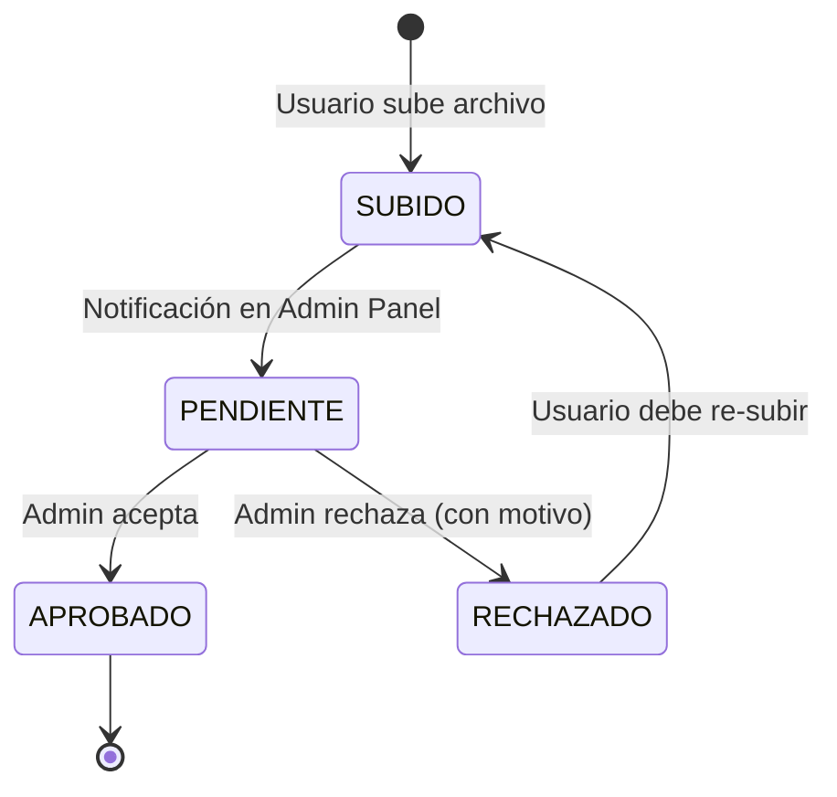

# Sistema de Verificación de Identidad

Para garantizar la seguridad en **AlquilaYa**, todos los usuarios (Estudiantes y Arrendadores) deben pasar por un proceso de verificación de identidad mediante documentos oficiales.

## Flujo del Documento

## Tipos de Documentos soportados

1.  **DNI_FRONTAL**: Imagen de la parte delantera del DNI.
2.  **DNI_REVERSO**: Imagen de la parte trasera del DNI.
3.  **CARNE_ESTUDIANTE**: Solo para el rol `ESTUDIANTE`.
4.  **RECIBO_LUZ**: Para el rol `ARRENDADOR` (verificación de dirección).

## Consideraciones Técnicas

-   **Almacenamiento**: Los archivos se guardan en la carpeta `uploads/documents/` dentro del microservicio de usuarios.
-   **Seguridad**: El nombre del archivo se enmascara con un `UUID` para evitar ataques de enumeración.
-   **Validación**: Solo se permiten archivos **menores a 5MB** y en formatos **JPG, PNG o PDF**.

## Endpoints Clave (Servicio Usuarios)

-   `POST /api/v1/usuarios/documentos/upload`: Sube un archivo multipart.
-   `GET /api/v1/usuarios/documentos/pendientes`: Lista documentos para revisión administrativa.
-   `PUT /api/v1/usuarios/documentos/{id}/verificar`: Cambia el estado (APROBADO/RECHAZADO).
