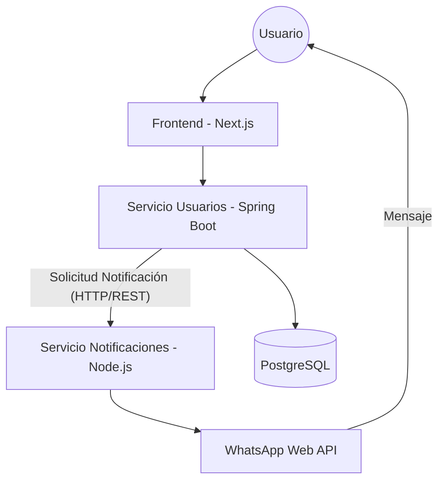

# Archivo de Arquitectura - AlquilaYa

AlquilaYa es una plataforma de gestión de alquileres para estudiantes y arrendadores, construida con una arquitectura de microservicios híbrida para maximizar la escalabilidad y la eficiencia en las notificaciones.

## Microservicios y Tecnologías

| Componente | Tecnología | Responsabilidad |
| :--- | :--- | :--- |
| **Frontend** | Next.js (React) | Interfaz de usuario, validaciones con Zod y Zustand. |
| **Servicio Usuarios** | Spring Boot | Gestión de perfiles, autenticación JWT y verificación de documentos. |
| **Notificaciones** | Node.js | Integración con WhatsApp Web (whatsapp-web.js) y envío de OTP. |
| **Base de Datos** | PostgreSQL | Persistencia de datos de usuarios, propiedades y documentos. |

## Diagrama de Comunicación

## Flujos Principales

1.  **Registro y Verificación**: El usuario se registra -> `Servicio Usuarios` crea el perfil -> Solicita a `Servicio Notificaciones` enviar un OTP -> El usuario verifica su número -> El sistema marca el teléfono como verificado.
2.  **Verificación de Identidad**: El usuario sube documentos (DNI, Carné) -> Se guardan físicamente en el servidor -> Un administrador aprueba/rechaza -> Se dispara una notificación de WhatsApp automática con el resultado.
