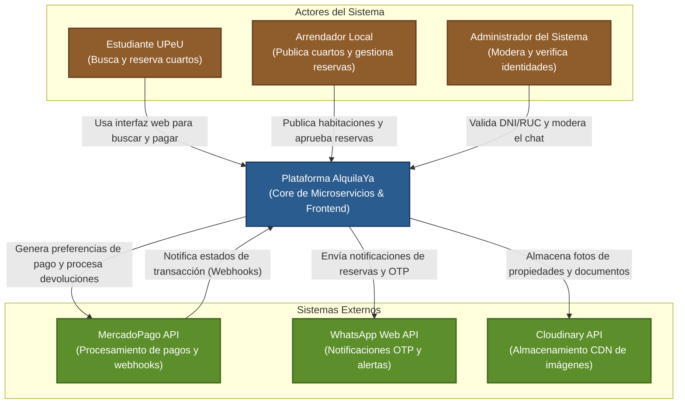
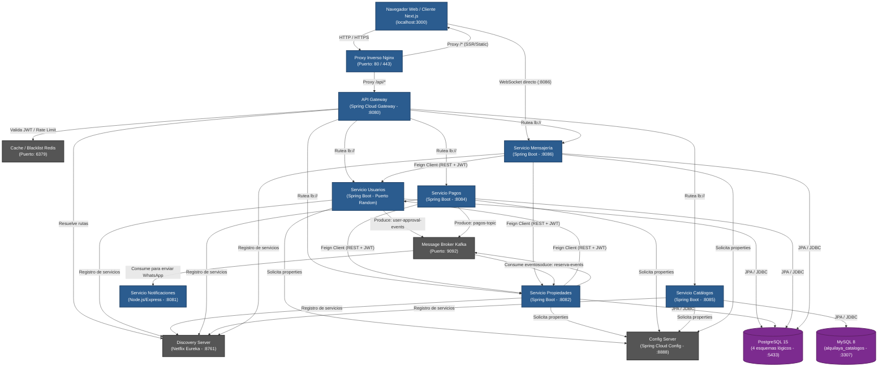
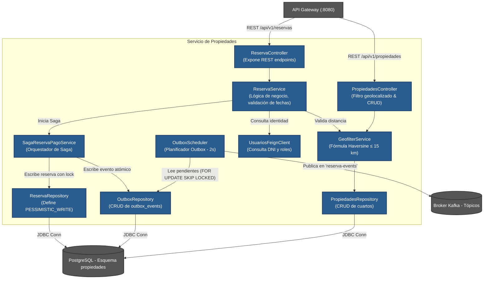
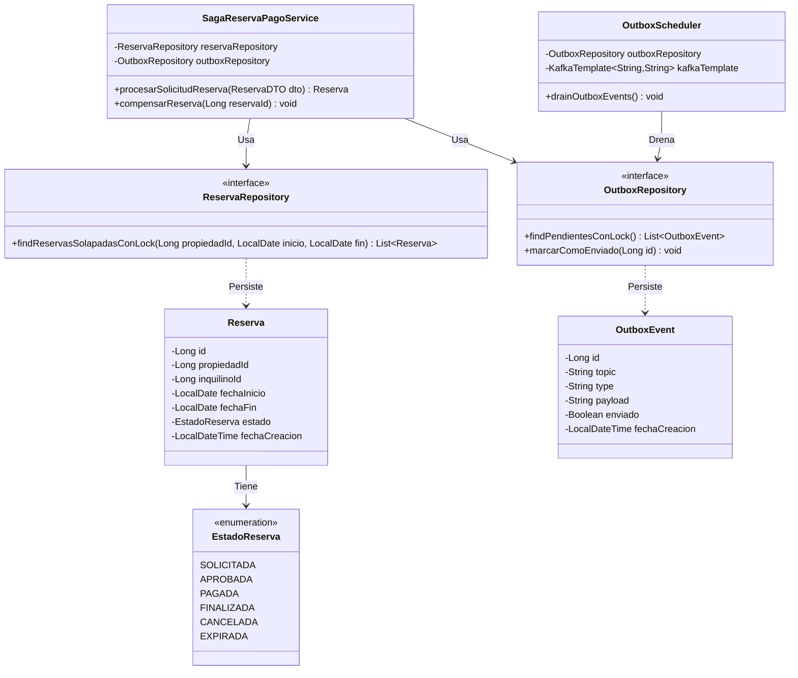

# 6. ARQUITECTURA DEL SISTEMA – MODELO C4

Este capítulo detalla el diseño arquitectónico de **AlquilaYa**, estructurado bajo el estándar internacional del **Modelo C4** (Contexto, Contenedores, Componentes y Código), sumando un quinto nivel correspondiente al Diagrama de Despliegue Físico y de Red. El diseño técnico adoptado responde a los requisitos de alta disponibilidad, consistencia eventual, aislamiento de fallos y resiliencia en un entorno de microservicios distribuido.

---

## 6.1. Nivel 1: Context Diagram (Diagrama de Contexto)

El Diagrama de Contexto establece las fronteras del sistema **AlquilaYa**, identificando a los actores humanos que interactúan con él y las relaciones críticas con sistemas externos (terceros) que complementan la lógica del negocio.

### 6.1.1. Justificación Técnica
La arquitectura perimetral a nivel de contexto separa claramente las responsabilidades del sistema de las plataformas externas especializadas. Esto minimiza el acoplamiento y delega servicios complejos (como pasarelas de pago y envíos masivos de mensajería) a proveedores SaaS consolidados, garantizando el cumplimiento normativo (PCI-DSS para pagos) y la estabilidad operativa.

### 6.1.2. Diagrama de Contexto (Mermaid)



### 6.1.3. Descripción de Relaciones e Interacciones
La Tabla I detalla la interacción técnica de los flujos de contexto del sistema.

<div align="center">
  
**TABLA I**  
**MATRIZ DE INTERACCIONES DE CONTEXTO**

| ID | Origen | Destino | Protocolo / Canal | Descripción |
|:---|:---|:---|:---|:---|
| C1 | Usuarios | AlquilaYa | HTTPS / WSS | Acceso a las aplicaciones de negocio (búsqueda, reservas, chat). |
| C2 | AlquilaYa | MercadoPago | REST (HTTPS) | Registro de tokens de cobro (Checkout Pro) y órdenes de reembolso. |
| C3 | MercadoPago | AlquilaYa | REST (Webhooks) | Envío de notificaciones transaccionales asíncronas de cobro. |
| C4 | AlquilaYa | WhatsApp | HTTP (JSON) | Emisión de códigos OTP y alertas automáticas de estado de reserva. |
| C5 | AlquilaYa | Cloudinary | Multipart HTTP | Carga de binarios de imágenes (DNI, RUC, fachadas de inmuebles). |

</div>

---

## 6.2. Nivel 2: Container Diagram (Diagrama de Contenedores)

El Diagrama de Contenedores detalla la composición interna del sistema **AlquilaYa**, ilustrando los servicios lógicos (aplicaciones web, microservicios, bases de datos y colas) y cómo se comunican entre sí a través de protocolos de red.

### 6.2.1. Justificación Técnica
Se optó por una arquitectura de **Base de datos por servicio (Database-per-Service)** para evitar cuellos de botella e interdependencia a nivel de persistencia. El API Gateway unifica la seguridad, el CORS y la limitación de tasa (Rate Limiting) basándose en Redis. El Config Server centraliza la inyección de propiedades, permitiendo modificar credenciales y límites de resiliencia sin recompilar los contenedores Java.

### 6.2.2. Diagrama de Contenedores (Mermaid)



### 6.2.3. Resumen Técnico de Contenedores
La Tabla II especifica las características técnicas de cada contenedor desplegado.

<div align="center">
  
**TABLA II**  
**CARACTERÍSTICAS TÉCNICAS DE LOS CONTENEDORES**

| Contenedor | Tecnología | Propósito | Estrategia de Escalamiento |
|:---|:---|:---|:---|
| `Nginx` | Nginx Alpine | Proxy inverso, enrutamiento SSL/TLS, compresión Gzip. | Horizontal (detrás de ALB/NLB). |
| `api-gateway` | Java 21 / Spring Cloud Gateway | Enrutamiento inteligente, CORS, Rate Limiting reactivo. | Horizontal sin estado (Stateless). |
| `config-server` | Java 21 / Spring Cloud Config | Proveedor central de properties cifradas y perfiles. | Pasivo/Activo con réplica de volumen. |
| `discovery-server`| Java 21 / Netflix Eureka | Registro y resolución dinámica de nombres (Service Registry). | Clúster de dos nodos distribuidos. |
| `servicio-usuarios`| Java 21 / Spring Boot 3.5 | Seguridad, autenticación, control de perfiles y verificación. | Horizontal (basado en CPU/RAM). |
| `servicio-propiedades`| Java 21 / Spring Boot 3.5 | Catastro de inmuebles, geolocalización, ciclo de reservas. | Horizontal con bloqueos en DB. |
| `servicio-pagos` | Java 21 / Spring Boot 3.5 | Checkout con MercadoPago, procesamiento de webhooks. | Horizontal desacoplado por colas. |
| `servicio-catalogos`| Java 21 / Spring Boot 3.5 | Gestión de maestros de datos tabulares. | Bajo consumo, escalamiento mínimo. |
| `servicio-mensajeria`| Java 21 / Spring Boot 3.5 | Chat síncrono STOMP, mensajería en tiempo real. | Sesiones persistentes (Sticky Sessions). |
| `servicio-notif` | Node.js 20 / Express / puppeteer | Automatización de WhatsApp Web para OTP y notificaciones. | Single-replica por sesión QR. |
| `Redis Cache` | Redis Alpine | Almacenamiento en memoria de Blacklist de JWT y contadores. | Clúster Redis Sentinel. |
| `Apache Kafka` | Confluent Kafka 7.4 | Event streaming inmutable para la consistencia eventual. | Clúster de 3 Brokers con Zookeeper. |

</div>

---

## 6.3. Nivel 3: Component Diagram (Diagrama de Componentes)

El Diagrama de Componentes realiza una aproximación interna a la lógica de negocio del servicio clave del sistema: el **Servicio de Propiedades (servicio-propiedades)**, el cual procesa las reservas concurrentes utilizando el bloqueo pesimista en base de datos.

### 6.3.1. Justificación Técnico
Para mitigar el solapamiento de fechas y la sobreventa de alojamientos (Doble Reserva), este componente implementa un bloqueo de escritura pesimista (`PESSIMISTIC_WRITE`) a nivel de transacción de base de datos. Además, gestiona de forma asíncrona la emisión de eventos de dominio a través de un planificador Outbox (`OutboxScheduler`), garantizando la entrega confiable a Kafka sin bloquear el hilo de ejecución principal de la API.

### 6.3.2. Diagrama de Componentes (Mermaid)



---

## 6.4. Nivel 4: Code Diagram (Diagrama de Código / Estructura de Clases)

El Nivel 4 detalla la estructura física del código fuente implementado para procesar la consistencia transaccional eventual y el bloqueo pesimista en el flujo de reservas.

### 6.4.1. Código Relevante y Justificación
Para garantizar que dos estudiantes no puedan reservar la misma habitación en fechas solapadas, el repositorio JPA utiliza la anotación `@Lock(LockModeType.PESSIMISTIC_WRITE)`. El código relevante del repositorio y del servicio orquestador se detalla a continuación.

#### Fragmento 1: Repositorio con Bloqueo Pesimista (`ReservaRepository.java`)
```java
package com.alquilaya.serviciopropiedades.repositories;

import com.alquilaya.serviciopropiedades.models.Reserva;
import jakarta.persistence.LockModeType;
import org.springframework.data.jpa.repository.JpaRepository;
import org.springframework.data.jpa.repository.Lock;
import org.springframework.data.jpa.repository.Query;
import org.springframework.data.repository.query.Param;
import java.time.LocalDate;
import java.util.List;

public interface ReservaRepository extends JpaRepository<Reserva, Long> {

    @Lock(LockModeType.PESSIMISTIC_WRITE)
    @Query("SELECT r FROM Reserva r WHERE r.propiedadId = :propiedadId " +
           "AND r.estado IN ('APROBADA', 'PAGADA') " +
           "AND (:fechaInicio < r.fechaFin AND :fechaFin > r.fechaInicio)")
    List<Reserva> findReservasSolapadasConLock(
        @Param("propiedadId") Long propiedadId,
        @Param("fechaInicio") LocalDate fechaInicio,
        @Param("fechaFin") LocalDate fechaFin
    );
}
```

#### Fragmento 2: Orquestador de la Saga Transaccional (`SagaReservaPagoService.java`)
```java
package com.alquilaya.serviciopropiedades.saga.service;

import com.alquilaya.serviciopropiedades.models.*;
import com.alquilaya.serviciopropiedades.repositories.*;
import org.springframework.stereotype.Service;
import org.springframework.transaction.annotation.Transactional;
import java.time.LocalDateTime;
import java.util.List;

@Service
public class SagaReservaPagoService {

    private final ReservaRepository reservaRepository;
    private final OutboxRepository outboxRepository;

    public SagaReservaPagoService(ReservaRepository rRepo, OutboxRepository oRepo) {
        this.reservaRepository = rRepo;
        this.outboxRepository = oRepo;
    }

    @Transactional
    public Reserva procesarSolicitudReserva(ReservaDTO dto) {
        // 1. Obtener bloqueo de escritura y verificar solapamientos de fechas
        List<Reserva> solapadas = reservaRepository.findReservasSolapadasConLock(
            dto.getPropiedadId(), dto.getFechaInicio(), dto.getFechaFin()
        );
        
        if (!solapadas.isEmpty()) {
            throw new IllegalStateException("La habitación ya cuenta con una reserva activa en estas fechas.");
        }

        // 2. Crear la reserva en estado inicial 'SOLICITADA'
        Reserva nuevaReserva = new Reserva();
        nuevaReserva.setPropiedadId(dto.getPropiedadId());
        nuevaReserva.setInquilinoId(dto.getInquilinoId());
        nuevaReserva.setFechaInicio(dto.getFechaInicio());
        nuevaReserva.setFechaFin(dto.getFechaFin());
        nuevaReserva.setEstado(EstadoReserva.SOLICITADA);
        nuevaReserva.setFechaCreacion(LocalDateTime.now());
        
        Reserva guardada = reservaRepository.save(nuevaReserva);

        // 3. Escribir el evento en la tabla Outbox en la misma transacción atómica
        OutboxEvent event = new OutboxEvent();
        event.setTopic("reserva-events");
        event.setAggregateType("Reserva");
        event.setAggregateId(guardada.getId().toString());
        event.setType("RESERVA_CREADA");
        event.setPayload(String.format("{\"reservaId\":%d,\"inquilinoId\":%d}", guardada.getId(), guardada.getInquilinoId()));
        event.setEnviado(false);
        event.setFechaCreacion(LocalDateTime.now());
        
        outboxRepository.save(event);

        return guardada;
    }
}
```

### 6.4.2. Diagrama de Clases (Mermaid)



---

## 6.5. Nivel 5: Deployment Diagram (Diagrama de Despliegue)

El Diagrama de Despliegue detalla la topología de red, el mapeo de puertos y la distribución de los componentes del sistema sobre contenedores Docker en el entorno de producción.

### 6.5.1. Justificación Técnica
Para garantizar el aislamiento de recursos y proteger las bases de datos de accesos externos directos, se implementa una red privada virtual puente en Docker (`alquilaya-prod-network`). El único contenedor que tiene mapeados puertos al host físico del servidor (externo) es Nginx (puertos 80/443). El tráfico REST interno y el flujo de base de datos quedan aislados dentro de la subred privada de Docker.

### 6.5.2. Diagrama de Despliegue Físico y de Red (Mermaid)

```mermaid
graph TB
    subgraph HostServer [Servidor Físico / VM Windows - Linux]
        %% Red Virtual Privada
        subgraph DockerNetwork [Red Docker: alquilaya-prod-network / Subnet: 172.19.0.0/16]
            
            %% Contenedores de Lógica
            NginxContainer["Contenedor: alquilaya-nginx<br>(Nginx 1.27 Alpine)<br>IP: 172.19.0.17"]
            GatewayContainer["Contenedor: alquilaya-gateway<br>(Spring Cloud Gateway)<br>IP: 172.19.0.4"]
            DiscoveryContainer["Contenedor: alquilaya-discovery<br>(Netflix Eureka)<br>IP: 172.19.0.2"]
            ConfigContainer["Contenedor: alquilaya-config<br>(Spring Cloud Config)<br>IP: 172.19.0.3"]
            
            %% Microservicios
            MS_UsuariosC["Contenedor: alquilaya-usuarios<br>IP: 172.19.0.15"]
            MS_PropiedadesC["Contenedor: alquilaya-propiedades<br>IP: 172.19.0.14"]
            MS_PagosC["Contenedor: alquilaya-pagos<br>IP: 172.19.0.13"]
            MS_CatalogosC["Contenedor: alquilaya-catalogos<br>IP: 172.19.0.11"]
            MS_MensajeriaC["Contenedor: alquilaya-mensajeria<br>IP: 172.19.0.12"]
            MS_NotifC["Contenedor: alquilaya-notificaciones<br>IP: 172.19.0.10"]

            %% Contenedores de Persistencia e Infra
            RedisContainer["Contenedor: alquilaya-redis<br>(Redis 7.4)<br>IP: 172.19.0.5"]
            PostgresContainer["Contenedor: alquilaya-postgres<br>(PostgreSQL 15)<br>IP: 172.19.0.8"]
            MySQLContainer["Contenedor: alquilaya-mysql<br>(MySQL 8)<br>IP: 172.19.0.6"]
            KafkaContainer["Contenedor: alquilaya-kafka<br>(Kafka + ZooKeeper)<br>IP: 172.19.0.9"]

        end

        %% Volumenes Mapeados del Host
        subgraph Volumes [Mapeo de Volúmenes en el Host]
            vol_pg["./postgres_data"]
            vol_my["./mysql_data"]
            vol_red["./redis_data"]
            vol_wa["./whatsapp_auth"]
        end
    end

    %% Redes Externas
    Internet((Internet))

    %% Enrutamiento Externo
    Internet -->|"Puerto: 80 / 443"| NginxContainer
    Internet -->|"Puerto: 8086 (WebSocket Chat)"| MS_MensajeriaC

    %% Mapeos Lógicos en Nginx
    NginxContainer -->|"Redirecciona /api/* al :8080"| GatewayContainer
    NginxContainer -->|"Redirecciona /* al Frontend (SSR)"| Internet

    %% Conexión de Volúmenes
    PostgresContainer --> vol_pg
    MySQLContainer --> vol_my
    RedisContainer --> vol_red
    MS_NotifC --> vol_wa

    classDef host fill:#edeae6,stroke:#7d7568,color:#333333,stroke-width:2px;
    classDef container fill:#2b5c8f,stroke:#1e3f63,color:#ffffff,stroke-width:2px;
    classDef volume fill:#8f842b,stroke:#635c1e,color:#ffffff,stroke-width:2px;

    class HostServer host;
    class NginxContainer,GatewayContainer,DiscoveryContainer,ConfigContainer,MS_UsuariosC,MS_PropiedadesC,MS_PagosC,MS_CatalogosC,MS_MensajeriaC,MS_NotifC,RedisContainer,PostgresContainer,MySQLContainer,KafkaContainer container;
    class vol_pg,vol_my,vol_red,vol_wa volume;
```



---

## 6.6. Verificación Arquitectónica del Flujo Transaccional

Para corroborar la robustez del modelo C4 implementado, la Tabla III modela las transacciones compensatorias del **Saga Pattern** ante un escenario crítico de pago rechazado.

<div align="center">
  
**TABLA III**  
**TRAZABILIDAD Y ACCIONES COMPENSATORIAS DE LA SAGA**

| Paso | Microservicio | Acción Local Realizada | Estado de Reserva | Evento Emitido a Kafka | Acción Compensatoria (en caso de fallo) |
|:---|:---|:---|:---|:---|:---|
| 1 | `servicio-propiedades` | Estudiante solicita reserva en fechas libres. Se bloquea la fila. | `SOLICITADA` | `RESERVA_CREADA` | N/A (Fallo síncrono, aborta transacción local). |
| 2 | `servicio-propiedades` | Arrendador evalúa e introduce aprobación de reserva. | `APROBADA` | `RESERVA_APROBADA` | Cambiar a `CANCELADA` y liberar fechas bloqueadas. |
| 3 | `servicio-pagos` | Genera link MercadoPago. Espera webhook de cobro. | `APROBADA` | `PAGO_INICIADO` | Anular ticket de cobro en pasarela. |
| 4.a | `servicio-pagos` | Transacción exitosa recibida en webhook. | `APROBADA` | `PAGO_EXITOSO` | Emitir `REFUND_REQUERIDO` y devolver dinero vía API. |
| 4.b | `servicio-propiedades` | Consume `PAGO_EXITOSO` y confirma definitivo. | `PAGADA` | `RESERVA_CONFIRMADA`| Liberar reserva y revertir estado a `CANCELADA`. |
| 5.a | `servicio-pagos` | Webhook notifica pago rechazado o cancelado. | `APROBADA` | `PAGO_FALLIDO` | N/A. |
| 5.b | `servicio-propiedades` | Consume `PAGO_FALLIDO`. Revierte reserva. | `CANCELADA` | `RESERVA_CANCELADA` | Liberar fechas del cuarto inmediatamente. |

</div>
