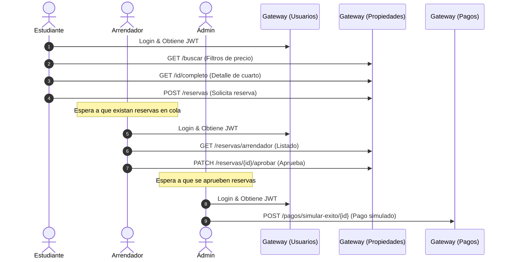

# Suite de Pruebas de Estrés y Carga para AlquilaYa

Este directorio contiene herramientas en Python para realizar pruebas de carga y estrés sobre los microservicios de **AlquilaYa**. Las pruebas están diseñadas para simular el comportamiento de usuarios concurrentes reales realizando consultas (lecturas) y reservas de propiedades (escrituras en base de datos, producción/consumo de Kafka y comunicación Feign).

---

## 🛠️ Requisitos Previos

Asegúrate de tener Python 3 instalado en tu sistema. Luego, instala las dependencias necesarias:

```bash
pip install requests locust
```

> [!NOTE]
> Las pruebas requieren que la infraestructura del backend esté levantada (`docker compose up -d`) y que los microservicios estén activos (`.\scripts\start-all.ps1`). Además, la base de datos debe contener los datos iniciales de prueba (los cuales se cargan automáticamente mediante las clases `Seed` de Spring en el arranque).

---

## 🚀 Opción 1: Script Standalone de Consola (`stress_test.py`)

Este es un script ligero que corre directamente en tu terminal. Utiliza hilos múltiples concurrentes (`ThreadPoolExecutor`) y realiza peticiones HTTP simultáneas midiendo métricas clave.

### Características
- **Sin dependencias pesadas:** Solo requiere la librería standard de Python y `requests`.
- **Métricas detalladas:** Calcula latencias mínimas, máximas, promedio y percentiles de corte importantes como el **P95** y **P99** (útiles para saber si el sistema responde rápido al 95% o 99% de los usuarios).
- **Control total:** Configura el número de usuarios, la duración de la prueba y el tipo de escenario.

### Ejecución básica
Corre la prueba con 5 usuarios concurrentes por 15 segundos:
```bash
python stress-test/stress_test.py
```

### Opciones de configuración
Puedes pasarle los siguientes argumentos por línea de comandos:

| Argumento | Por Defecto | Descripción |
|---|---|---|
| `--url` | `http://localhost:8080` | URL base del API Gateway. |
| `--users` | `5` | Número de usuarios concurrentes simulados (hilos). |
| `--duration` | `15` | Duración del test en segundos. |
| `--scenario` | `all` | Qué tipo de test ejecutar: `read` (búsquedas), `write` (reservas/pagos) o `all` (mixto). |

#### Ejemplo avanzado:
Ejecutar un test enfocado solo en escrituras (crear reservas, aprobarlas y pagarlas) con 20 usuarios concurrentes durante 60 segundos:
```bash
python stress-test/stress_test.py --users 20 --duration 60 --scenario write
```

---

## 📈 Opción 2: Locust con Interfaz Gráfica (`locustfile.py`)

[Locust](https://locust.io/) es una herramienta profesional de carga en Python que te permite simular miles de usuarios distribuidos y te brinda una interfaz web muy completa y visual.

### Características
- **Interfaz Web:** Gráficos en tiempo real de RPS (Peticiones por Segundo), tiempos de respuesta (latencias) y tasa de fallos.
- **Roles Coordinados:** Simula 3 tipos de comportamiento que interactúan en tiempo real:
  1. **Estudiantes (`StudentUser` - 70% peso):** Buscan propiedades, ven detalles y solicitan reservas. Las reservas creadas se colocan en una cola interna.
  2. **Arrendadores (`LandlordUser` - 20% peso):** Listan reservas y aprueban las reservas solicitadas que están en la cola. Las reservas aprobadas pasan a la cola de pagos.
  3. **Administradores (`AdminUser` - 10% peso):** Simulan el webhook de pagos exitosos de las reservas aprobadas de la cola de pagos.
- **Gráficos Exportables:** Permite descargar reportes completos en CSV y PDF.

### Ejecución
1. Inicia Locust apuntando al archivo de pruebas:
   ```bash
   locust -f stress-test/locustfile.py
   ```
2. Abre tu navegador e ingresa a: **`http://localhost:8089`**
3. Configura:
   - **Number of users:** Cuántos usuarios simulados deseas en total (ej. `50`).
   - **Spawn rate:** Cuántos usuarios añadir por segundo (ej. `5`).
   - **Host:** La dirección de tu API Gateway (debe ser: `http://localhost:8080`).
4. Presiona **Start swarming** para comenzar a enviar carga al sistema.

---

## 🔬 Flujo de Negocio Simulado (E2E)

Ambos scripts no solo hacen peticiones al azar, sino que coordinan un flujo completo de negocio simulando la interacción real:



1. **Estudiante:** Inicia sesión (`estudiante@gmail.com`), busca habitaciones y realiza una reserva (`Estado: SOLICITADA`).
2. **Arrendador:** Inicia sesión (`arrendador@gmail.com`), ve la reserva y la aprueba (`Estado: APROBADA`).
3. **Admin:** Inicia sesión (`admin@gmail.com`) y ejecuta la simulación de pago (`Estado: PAGADA`).

> **Evitando Colisiones:** Los scripts calculan fechas de reserva aleatorias muy lejanas en el futuro (ej. entre 30 y 20,000 días adelante) para evitar el solapamiento de fechas, permitiendo así que las reservas concurrentes sobre los mismos cuartos no fallen por reglas de negocio.
